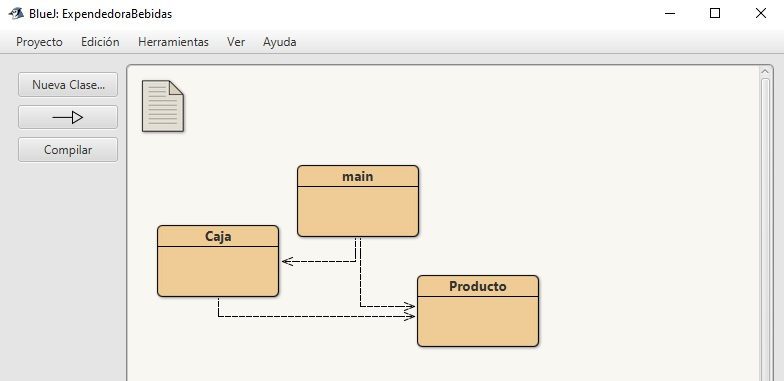
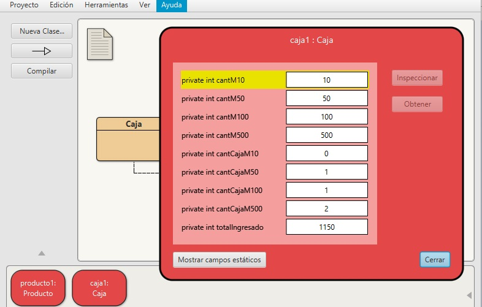
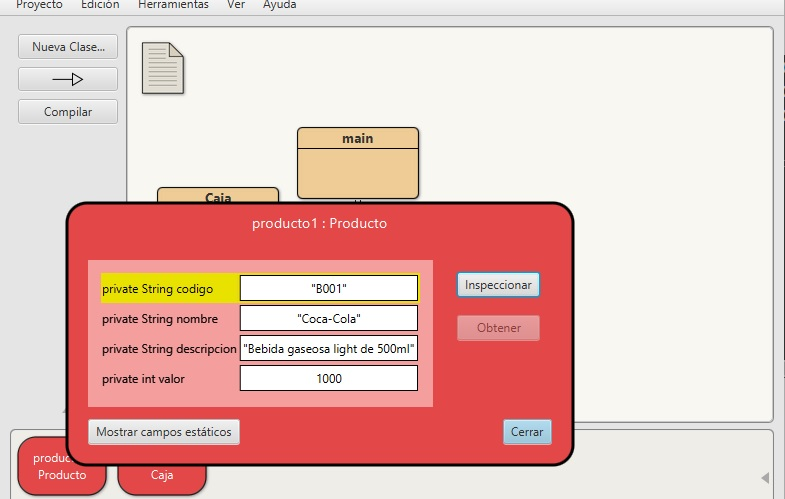
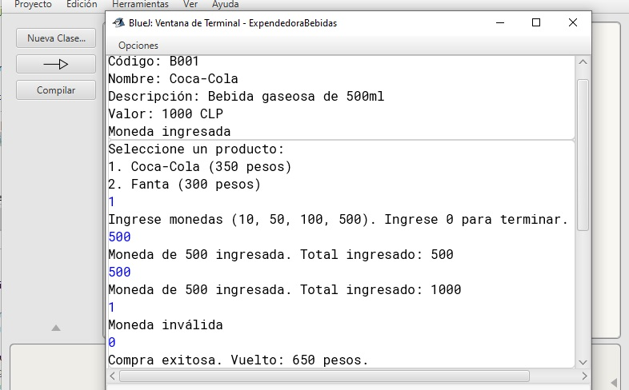

# Máquina Expendedora de Bebidas

Este proyecto simula el funcionamiento básico de una máquina expendedora de bebidas. La máquina puede aceptar monedas, registrar productos y realizar compras, devolviendo el vuelto adecuado.

## Requisitos

- **Java**: Asegúrate de tener Java instalado en tu sistema.
- **BlueJ**: Herramienta recomendada para la ejecución y depuración del proyecto.

## Estructura del Proyecto



El proyecto está compuesto por las siguientes clases:

1. **Caja**
   - **Propósito**: Gestiona el ingreso de monedas y el proceso de compra.
   - **Atributos**:
     - `cantM10`, `cantM50`, `cantM100`, `cantM500`: Cantidades de monedas en el contenedor de vuelto.
     - `cantCajaM10`, `cantCajaM50`, `cantCajaM100`, `cantCajaM500`: Cantidades de monedas ingresadas.
   - **Métodos**:
     - `ingresarMoneda(int moneda)`: Permite ingresar monedas válidas.
     - `comprarProducto(Producto producto)`: Procesa la compra de un producto y calcula el vuelto.
     - Métodos `get` para obtener las cantidades de monedas.

2. **Producto**
   - **Propósito**: Define los productos que pueden ser comprados en la máquina.
   - **Atributos**:
     - `codigo`, `nombre`, `descripcion`, `valor`: Detalles del producto.
   - **Métodos**:
     - Métodos `get` y `set` para manipular los atributos del producto.

3. **Main**
   - **Propósito**: Ejecuta el método principal para simular el funcionamiento de la máquina expendedora.
   - **Métodos**:
     - `main(String[] args)`: Crea instancias de `Caja` y `Producto`, ingresa monedas, y realiza una compra.

## Cómo Ejecutar el Proyecto



1. **Abrir el Proyecto en BlueJ**:
   - Abre BlueJ y carga el proyecto.

2. **Compilar las Clases**:
   - Haz clic en el botón de **Compilar** para asegurarte de que no haya errores de compilación.

3. **Ejecutar el Método `main`**:
   - Haz clic derecho en la clase `Main` en el diagrama de clases.
   - Selecciona `void main(String[] args)` para ejecutar el método `main`.
   - Deja el campo de argumentos vacío y haz clic en **OK**.

4. **Ver los Resultados**:
   - Revisa la ventana de consola en BlueJ para observar los resultados de la ejecución del método `main`.

## Ejemplo de Uso

Aquí hay un ejemplo de cómo el método `main` simula una operación de la máquina expendedora:

```java
public class Main {
    public static void main(String[] args) {
        // Crear una instancia de la clase Caja con monedas en el contenedor de vuelto
        Caja miCaja = new Caja(100, 50, 200, 20);

        // Crear un producto
        Producto bebida = new Producto("001", "Cola", "Bebida refrescante", 150);

        // Ingresar monedas
        System.out.println(miCaja.ingresarMoneda(10));
        System.out.println(miCaja.ingresarMoneda(50));
        System.out.println(miCaja.ingresarMoneda(100));
        System.out.println(miCaja.ingresarMoneda(500));

        // Intentar comprar el producto
        System.out.println(miCaja.comprarProducto(bebida));
    }
}
